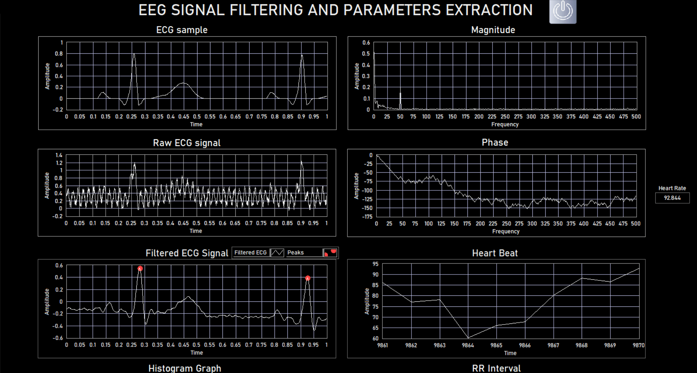
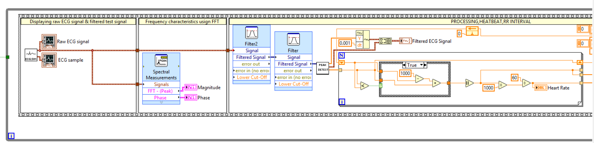

# ECG Signal Acquisition, Processing and Analysis (LabVIEW)

A LabVIEW application that takes a raw ECG signal, cleans it up, and pulls out a
full cardiac profile: heart rate, P-Q-R-S-T wave delineation, and frequency
analysis. I built this as a personal project to dig into biomedical signal
processing and sharpen my LabVIEW skills.

## What it does
- Loads or acquires a raw ECG signal
- Removes noise with low-pass and high-pass digital filters
- Detects the P, Q, R, S, and T waves
- Calculates heart rate from the R-R interval
- Runs FFT-based frequency analysis on the signal

## Screenshots

**Front panel**

**Block diagram**

## How it works
The raw signal first passes through a filter stage to strip out baseline wander
and high-frequency noise that tends to hide the real ECG features. From the
cleaned signal I detect the R peaks, then locate the surrounding P, Q, S, and T
points relative to each beat. Heart rate comes from the spacing between R peaks,
and an FFT gives a view of the signal in the frequency domain.

## Built with
- LabVIEW 2021
- NI Signal Processing functions

## Skills demonstrated
LabVIEW, Signal Processing, Digital Filtering, FFT, Biomedical Signal Analysis

## Notes
This is a personal learning project. The sample signal used here comes from simulated data.
